# Predicting residential energy consumption based on attributes of the house
We all pay our electric and gas bills, and there are factors that we can actually change in order to minimize our expenses. Knowing what and how influences our bills, we can make an informed decision on how to control our home’s parameters. 

I set a goal to create a model that will predict the total cost of energy utilities, but in this post we’ll investigate the influence of different home attributes on it. 

*It can be useful to:*

* homeowners thinking about home improvements or buying new appliances, answering the questions like “how much will I save if I insulate my attic”, or “should I really install smart thermostat”;
* contractors helping to persuade customers to renovation project;
* real estate brokers, helping make their customers more informed decisions by estimating heating and electric utilities cost.

# Data Wrangling

The data is provided by U.S. Energy Information Administration in their [residential energy consumption survey](https://www.eia.gov/consumption/residential/data/2015/index.php?view=microdata) for the 2015 year.

According to RECS, this is a national sample survey that collects energy-related data for housing units occupied as a primary residence and the households that live in them. Data were collected from more than 5,600 households selected at random using a complex multistage, area-probability sample design. The sample represents 118.2 million U.S. households.

Data was read from .csv file. It has 759 columns and 5686 rows. It's hard to get meaning from columns names with the abbreviation, and categorical variables encrypted with codes, values of which are stored in a separate file codebook_publicv4.xlsx.

Using the information provided in the additional file, I renamed columns according to their description and changed categorical variables codes to their values. Also, I converted columns containing categorical data to do type 'category'. 
Some columns which don't contain direct measures for our households, as well as columns containing somehow overlapping information, have been dropped. 

The data has been split into predictive variables X and target variables, describing total energy consumption as a combination of different power sources (electricity, gas, oil), in BTU.

# Missing values
Our data have no actual missing values, although it has a lot of 'Not applicable', like the type of pool heating system for houses without a pool.

For numerical variables,  I replaced some numerical variables like the ones with temperature, with maximum or minimum of the column, while for most others just with 0.

For categorical variables, variables with “Yes”/”No” subset of values have been filled with “No”, some with default, and some with most common values.

All numerical variables have been normalized using sklearn’s StandardScaler (bringing them to mean of 0 and standard deviation of 1, and all categorical have been transformed to One Hot Encoding representation using  pd.get_dummies method.

# Cleaned data
After cleaning, our predictive variables looks like follows:

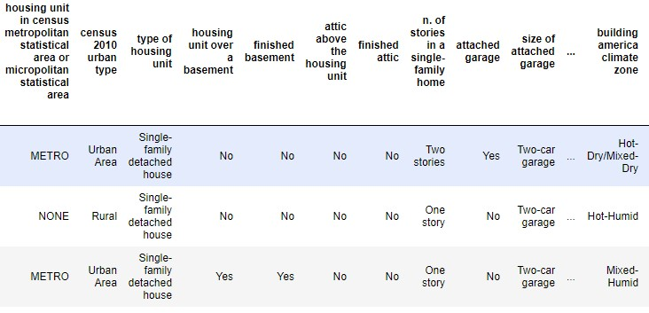


It has 5686 rows and 256 columns. 


# Exploratory Analysis
As one of the largest energy consumption factors of residential dwellings is heating/cooling, let’s take a look into square footage of the houses.

The mean size of the house is 2081 sq ft. The distribution of total square footage" is very right-skewed.

The average heated area is 1815 sq ft, also right-skewed. A lot of houses don’t have heating at all.

Average cooled area is much smaller - 1454 sq ft, much more houses don’t have cooling systems, or have it in only small parts of the homes. 

Cooled vs. heated square footage plot shows that many houses have cooled areas the same as heating, but a lot of them have heated areas larger than cooling. A small fraction of households has a cooled area larger than heated. 

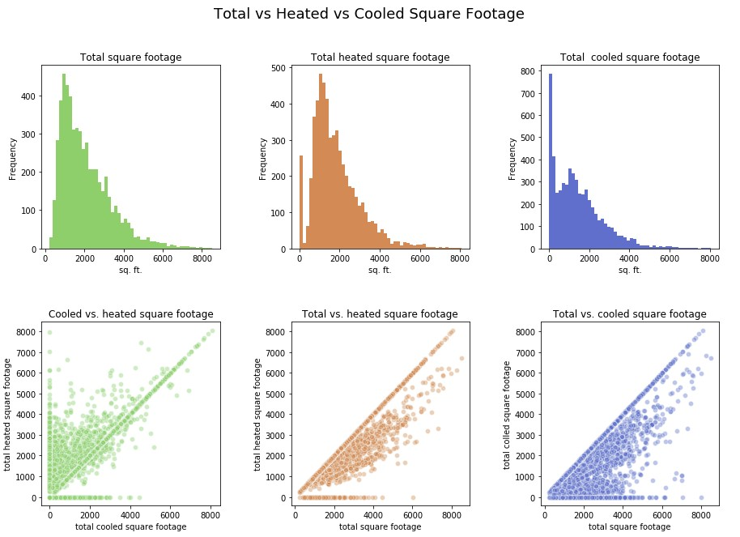


### Temperature in Winter
I was curious whether having a programmable or smart thermostat actually helps to lower the temperature when not needed.

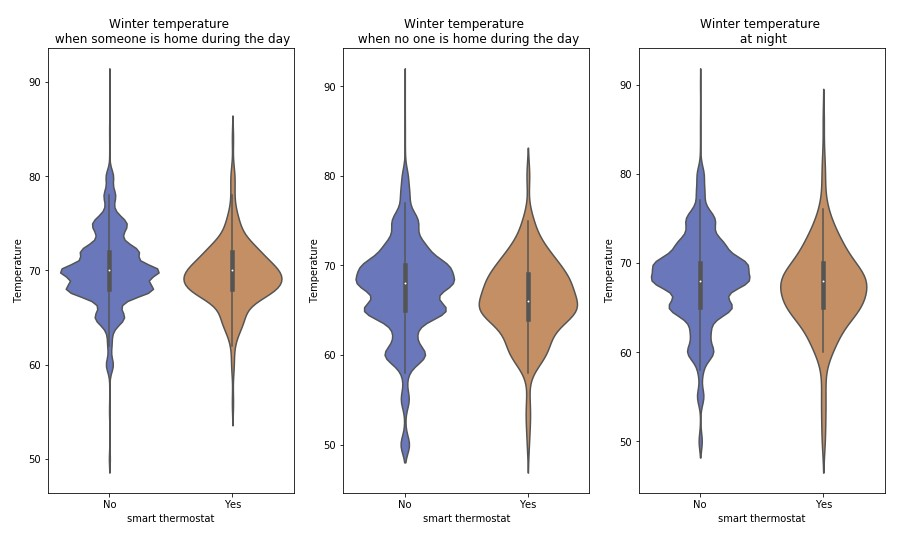


Distribution of temperatures for homes with smart thermostats look smoother than those without or with regular programmable ones, instead of uneven binomial distribution, we see almost perfect normal one. 

Smother normal distribution makes households with smart thermostats easier to predict. 
50% quantile for temperature when someone at home or at night quantile is the same for people with smart thermostats and without, while temperature when no one at home is noticeably lower.

If our goal is to minimize consumption, it would make sense to promote using a smart thermostat.  Only a small fraction of people used it in 2015. Hopefully, this percentage has increased by 2019.

Also, the larger the home is, the harder it is to keep it warm. Winter temperature when someone is home during the day vs. total square footage plot shows that there is a negative trend:

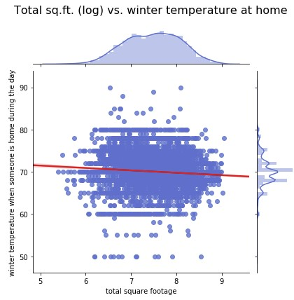


## Correlation heatmap


The size of the home is predictably the most important factor, so is the number of rooms, refrigerators used, the number of televisions used, frequency of clothes dryer use, a number of inside light bulbs turned on at least 4 hours a day. The correlation heatmap, as well as the top 20 variables with the highest correlation with the target variable,  are shown below:

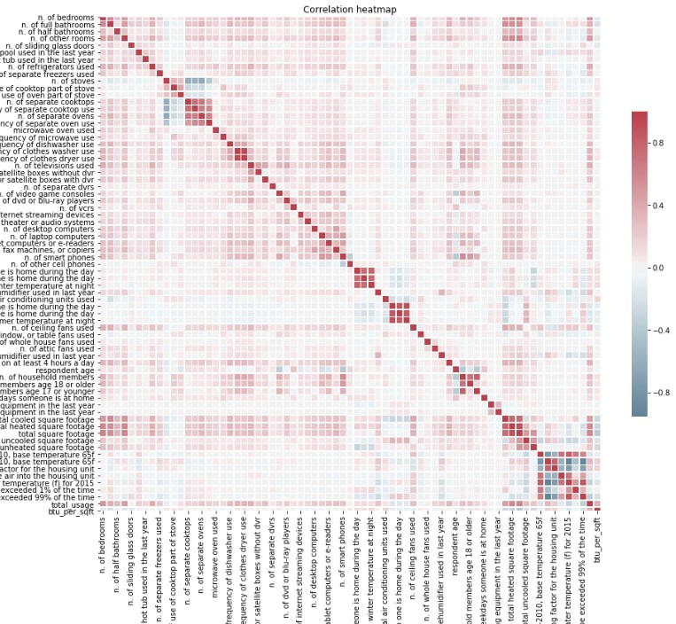

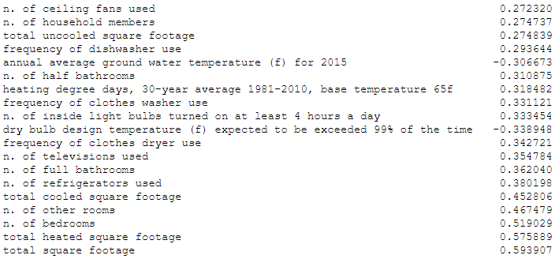

## Total square footage vs. total energy usage 

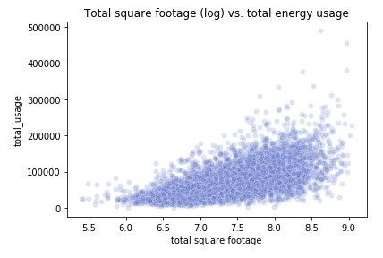

Plot Total square footage (log) vs. total energy usage shows that knowing the area of the home, we can easily predict upper bound - it’s a diagonal line, with no outliers beyond it.
Total square footage is so powerful predictor variable, that in order to see the effect of some categorical variables (below), I added energy used by sq ft: *'btu_per_sqft' * variable.

## Energy usage per sq. ft. vs. years when housing unit was built

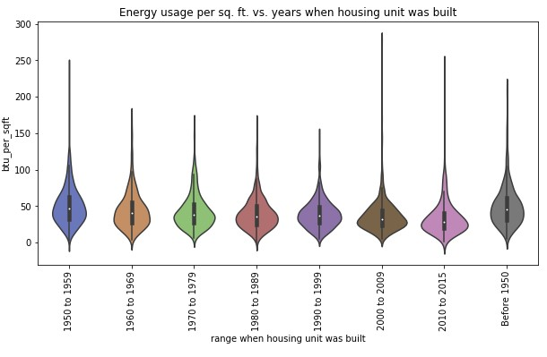

This plot shows a clear trend that newer houses are more energy efficient. This can serve as another reason to persuade the contractor's client to build new construction, rather than renovate.  

### Energy usage per sq. ft. for housing unit types per own or rent

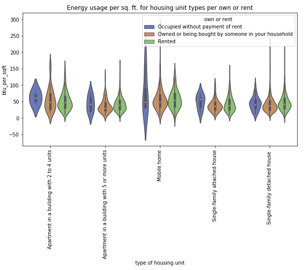


People who rent spend more per sq ft than whose who owns for every unit type, except for 2-4 units apartments. Those, knowing if the unit is owner or renter occupied, we can expect higher consumption. People who occupied without payment of rent spend so much more. Perhaps, they are not financially responsible for utilities as well, that’s why not eager to use thoughtfully. May be programs which will educate people about the environmental impact of wasteful use for such people could make a difference, if money can’t.

T-test below confirms that average consumption per sq ft, as well as total consumption for people who owns and who rents are different (significant p-value):

``` python
Ttest_indResult(statistic=-5.092762322269505, pvalue=3.740187974122832e-07)
```

### Energy usage per sq. ft. vs. main space heating equipment type

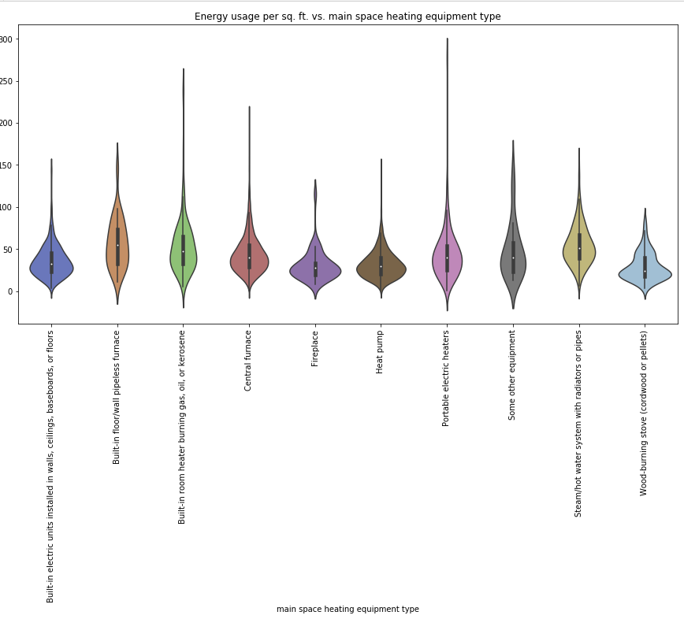

Energy usage per sq. ft. vs. main space heating equipment type plot basically shows the efficiency of heating equipment. For example, a steam/hot water system with radiators or pipes is visibly less effective than the central furnace, and both are outperformed by a heat pump. 

For potential HVAC company, this can be valuable information to convince their customers to change the system to a heat pump. 

Also, I tested the hypothesis that having or not having certain appliances in the home affects total consumption using the t-test. We have to reject the null hypothesis that having or not having clothes washer at the home has no effect on consumption. Same for clothes dryer, dishwasher, and even coffee maker.

# Model Selection

To select the best model 4 different ML models have been explored: ElasticNet, SVM, Neural Network (multilayer perceptron), and LightGBM.
В 
Also, to select the best subset of features, models with different sets of features have been used.

Data has been split to test and trains set (85% for training and 15% for testing), and 5-fold cross-validation have been used for hyper-parameters tuning.

R2 and MSE for every model are recording for every model.

Here is an example of fitting a model (LGBMRegressor in this case):

``` python
from lightgbm import LGBMRegressor
 
parameters = {
    "boosting_type": ["gbdt"],
    "metric": ["rmse"],
    "num_leaves": [20, 50, 100],
    "bagging_fraction": [0.2, 0.4],
    "feature_fraction": [0.2, 0.4],
    "learning_rate": [0.01, 0.001],
    "lambda_l2": [2, 5],
}


model = LGBMRegressor(n_estimators = 40000)
gm_cv = GridSearchCV(model, parameters, cv=5, n_jobs=16)

gm_cv.fit(X_train, y_train)
```

As a preprocessing step, data has been scaled and categorical variables have been one-hot encoded.

## LightGBM with abd without one-hot encoding
Although, according to [LightGBM method documentation](https://lightgbm.readthedocs.io/en/latest/Features.html#optimal-split-for-categorical-features), it is common to represent categorical features with one-hot encoding, but this approach is suboptimal for tree learners. Particularly for high-cardinality categorical features, a tree built on one-hot features tends to be unbalanced and needs to grow very deep to achieve good accuracy.
В 
That's why I tried both approaches: to feedВ LightGBM one-hot encoded data and to let LightGBM deal with categorical values on its own to see if this will lead to better performance.

The first approach let to 0.71 test R2 score, while second to 0.74. So I keep using the results of the second approach as a metric for LightGBM.

# Feature Engineering

For feature engineering, I used Neural Networks and SVM methods for subsets of variables (top 144, 200, 300, and 400 features).

I used two methods to select the top features: the most n important features according to the feature importance metric of LightGBM, and SelectKBest method.

To visualize the results of all methods tried, the following plot has been generated:

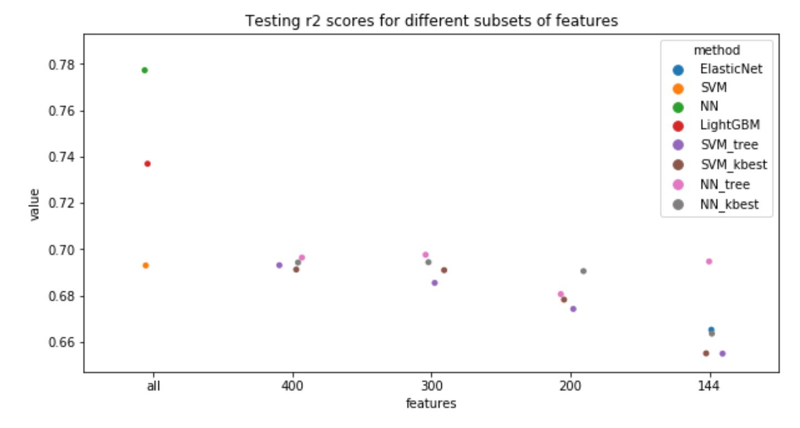

According to this plot, the best performance has the neural network on a full subset of variables, with a test score of 0.78, followed by LightGBM with 0.74.

Using a subset of variables doesn't improve the overall result. But, if we are interested in collecting fewer features to make a prediction, we can use NN with 144 features, which are suggested by LightGBM.

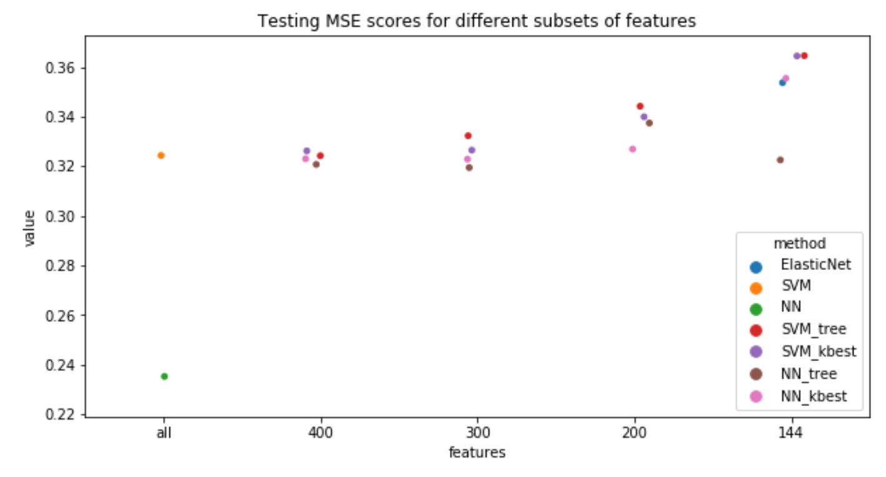

LightGMB is excluded from MSE plot, as the input data for it is not preprocessed, so it not comparable with other methods in absolute value. This plot shows the same tendency as with R2.

Although neural network gives the best performance, it's very hard to make interpretation from it. So let's use the next best method - LightGBM for feature interpretation.

# Features importance

Let's investigate the features which affect the prediction the most based on LightGBM method. To be sure that feature importance we observe is not just a property of a certain run of the model, I used the outcome from 5 models obtained from cross-validation.

Red boxplots mean that the feature is positively correlated with the outcome, blue - negative, and green - it 's a categorical feature.

Top 50 variables are as follows:

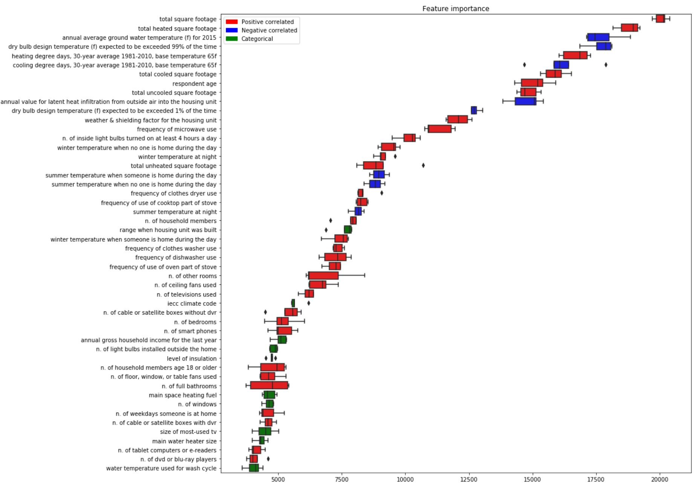

The spread of importance is fairly small, so we can assume that the results are stable.

Having a good predictor is good, but the real impact it'll have only when used in real world. In our [next post](https://juliazozulia.github.io/Business_applications_of_energy_consumption_predictions/)  I'll tell you about business application of the model we just created. 

The developed model allows us to estimate how much more/less will a household consume under new parameters. 

# Business applications of energy consumption predictions
## To estimate savings for consumer:
Let’s consider an example household: 
### One-story single-family detached house, 2553 sq ft, located in an urban area in Cold/Very Cold climate zone. 

The model estimates total consumption as 127,095 BTU. 

House now is poorly insulated. If the owner will insulate the house, his estimated saving will be as follows:

``` python
house_modified.loc[:, 'level of insulation'].replace('Poorly insulated', 'Well insulated', inplace = True)
model.predict(house_modified)
 
Original consumption: 127095.96 BTU
Modified consumption: 125607.74 BTU
Absolute savings:     1488.22 BTU
Percentage savings:   1.17 %
```

Changing windows to energy star qualified:

``` python
Absolute savings:     1301.38 BTU
Percentage savings:   1.02 %
```
Changing main space heating equipment to newer one (same type):
``` python
Absolute savings:     1926.4 BTU
Percentage savings:   1.52 %
```
Changing main space heating equipment from central furnace to heat pump would save us 6.44%:
``` python
Absolute savings:     8179.43 BTU
Percentage savings:   6.44 %
```
 
 
Another example:
### Rural 1676 sq. ft. single-family house located in hot-humid climate.

Predicted consumption is 90945.05 BTU.

It is already adequately insulated, but, if the owner insulates the house better, he would save 1.01%:
``` python
Original consumption: 90945.05 BTU
Modified consumption: 90024.01 BTU
Absolute savings:     921.04 BTU
Percentage savings:   1.01 %
```
The occupants keep summer temperature when no one is home during the day at 65°F, which is unusually low. By keeping it at 75°F and installing smart thermostat they would save 1.41%:
``` python
Original consumption: 90945.05 BTU
Modified consumption: 89658.33 BTU
Absolute savings:     1286.72 BTU
Percentage savings:   1.41 %
```
Not everyone would benefit from installing smart thermostats equally: our first example home would save only 0.14%.

All predictions here are in BTU, which is defined as the amount of heat required to raise the temperature of one pound of water by one degree Fahrenheit (counterpart in the metric system is the calorie). It is used as a unit of power and can be easily converted to whatever source of power the household is using. By knowing the user’s zip, we can easily acquire the corresponding electricity/gas/oil rate at this moment, thus, converting the prediction to monetary equivalent. 

## To contractors:

Apart from the end consumer, this model can be used by a variety of businesses, like:

* **HVAC contractors**, who would be able to give the customer a very quick estimate of potential savings associated with updating of heating/cooling equipment; 

* **Companies selling/installing windows**;

* **Insulation contractors**;

* **Energy assessment companies**, who would be able to recommend customers which parts of the house would yield to the highest savings.

Of course, each of these constructors would be able to estimate potential savings based on detailed engineering calculations, but those are usually very time consuming and require a qualified engineer, while this model allows making a *very quick estimate*, allowing to *keep potential customers*. 

## To real estate brokers:

Another business application of this model is estimating utilities cost while looking for a new home. **Real estate brokers** can incorporate it into their business process to help their customers to make more informed decisions by estimating heating and electric utilities cost for different homes. 

As to use the model on full subset of variables need gathering a lot of information about the home, and, in case of using it on new unseen homes, it may be a problem, the better approach would be to use a small subset of variables. 

Using subset of top 40 variables (based on tree-based feature importance metrics, and after removal of variable that are hard to estimate for unseen homes), gives us test score of 0.71.

Variables can be split into 3 subsets:

* locations based, can be assessed using zip code;
* family based,  are characteristics of the household and can get them be creating simple questionnaire for the clients, or, if not possible, using mean values;
* real estate based, are basic characteristics of building and are easily accessible in the listings. 

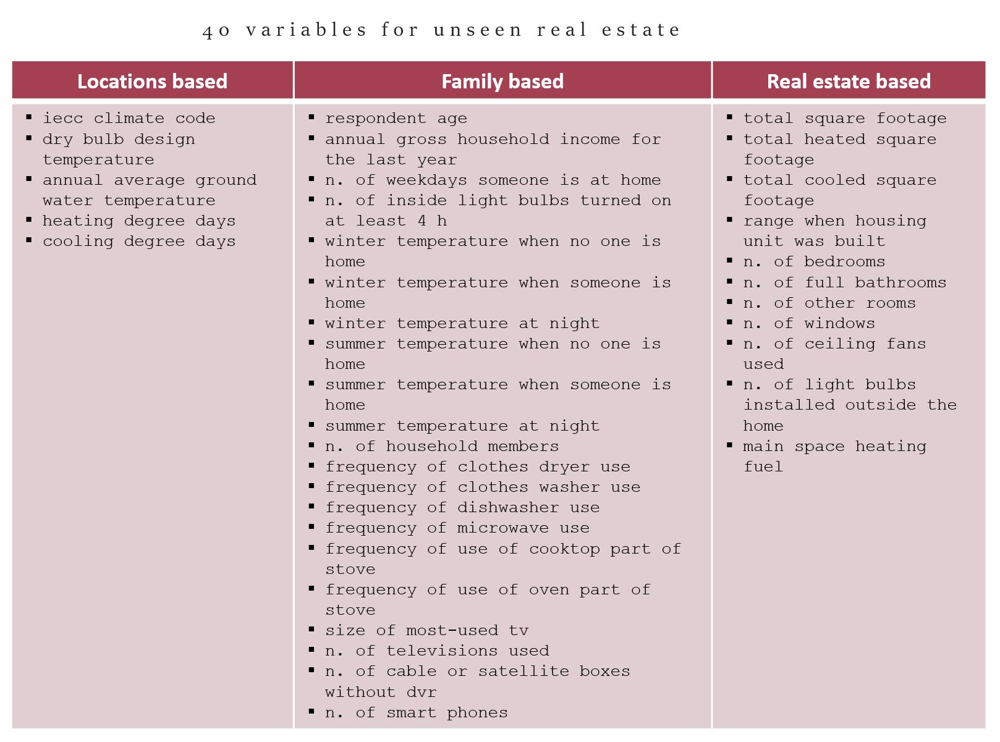

This way real estate brokers can have additional valuable information to provide to customers by using very small set of variables and the developed model. 

**New home buyers**, in return, would be able to predict their utilities bills with high precision. This is one unknown factor less when choosing monthly mortgage payment they can afford.  


